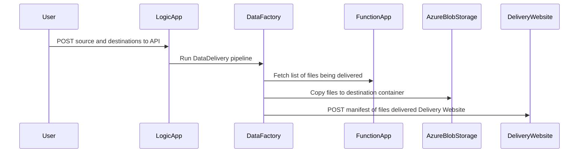

# DukeDataDeliveryPipeline
Services that deliver data stored in Azure between users.

## Azure Blob Storage Permissions
The following storage permissions are required:
- Data Factory
  - Write Permissions on the sink container
  - Read Permissions on the source container  
- Logic App
  - Read Permissions on the source container
  
  
 
