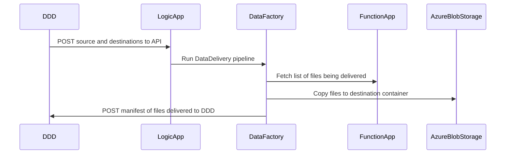

# DukeDataDeliveryPipeline
Services that deliver data stored in Azure between users.

## Detailed Flow

- [DDD - Duke Data Delivery Website](https://github.com/Duke-GCB/D4S2)
  - Sends POST request with Azure Blob Storage source and destination container paths
  - Receives a POST with manifest on sucess or a message on failure
- [LogicApp](logic-app.json)
  - Receives a POST request
  - Reads key vault for URL and authentication for webhook
  - Runs DataFactory passing request body and webhook config
- [DataFactory](data-factory.json)
  - Calls FunctionApp to create a manifest of files being delivered
  - Uses `Copy data` Activity to copy data to the destination
  - Notifies the external webhook on failure or success of the pipeline
- [FunctionApp](function-app)
  - Reads source files returning a manifest including file paths and their checksums

## Azure Blob Storage Permissions
The following storage permissions are required:
- Data Factory
  - Write Permissions on the sink container
  - Read Permissions on the source container  
- Function App
  - Read Permissions on the source container
