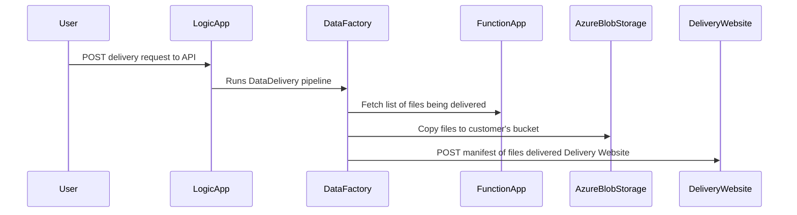

# DukeDataDeliveryPipeline
Services that deliver data stored in Azure between users.

## Azure Blob Storage Permissions
The following storage permissions are required:
- Data Factory
  - Write Permissions on the sink Container
  - Read Permissions on the source Container  
- Logic App
  - Read Permissions on the source Container
  
  
 
